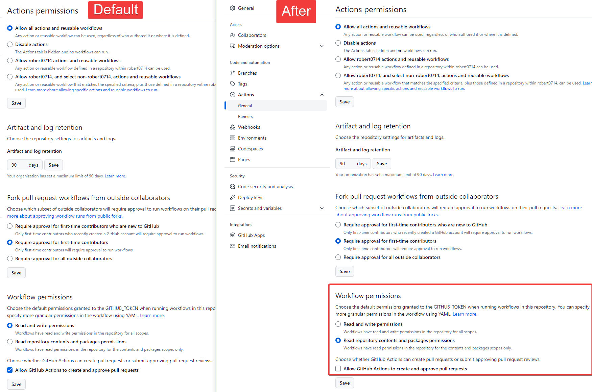

# Nomad Autoscaler Demos - demo-webapp-lb-guide

This repository hosts a series of demos for the [Nomad Autoscaler][nomad_autoscaler_repo].

## Basic CMD
* Localhost Test:
```bash
PORT=8080 go run .
```
* Docker Test:
```
minikube -p lab01 start
eval $(minikube -p lab01 docker-env )
docker build -t robert0714/demo-webapp-lb-guide . 
docker run  --env PORT=8080 -p 8080:8080 robert0714/demo-webapp-lb-guide
minikube -p lab01 ip

curl $(minikube -p lab01 ip):8080
  % Total    % Received % Xferd  Average Speed   Time    Time     Time  Current
                                 Dload  Upload   Total   Spent    Left  Speed
100    31  100    31    0     0  12104      0 --:--:-- --:--:-- --:--:-- 15500Welcome! You are on node :8080
```

## List of demos

  * [Horizontal Application Scaling][learn_horizontal_app_scaling]
  * [Horizontal Cluster Scaling][learn_horizontal_cluster_scaling]
  * [Dynamic Application Sizing][learn_dynamic_app_sizing]
  * [On-demand Batch Job Cluster Scaling][learn_on_demand_batch]

[learn_horizontal_app_scaling]: https://learn.hashicorp.com/tutorials/nomad/autoscaler-vagrant-demo?in=nomad/autoscaler
[learn_horizontal_cluster_scaling]: https://learn.hashicorp.com/tutorials/nomad/horizontal-cluster-scaling?in=nomad/autoscaler
[learn_dynamic_app_sizing]: https://learn.hashicorp.com/tutorials/nomad/dynamic-application-sizing?in=nomad/autoscaler
[learn_on_demand_batch]: https://learn.hashicorp.com/tutorials/nomad/horizontal-cluster-scaling-on-demand-batch?in=nomad/autoscaler
[nomad_autoscaler_repo]: https://github.com/hashicorp/nomad-autoscaler

# Github Actions Setting
  

## Working with the Container registry[https://ghcr.io]
* https://docs.github.com/en/packages/working-with-a-github-packages-registry/working-with-the-container-registry
## [Creating a personal access token](https://docs.github.com/en/authentication/keeping-your-account-and-data-secure/creating-a-personal-access-token)

## Note
* [Make sure the package is public](https://docs.github.com/en/packages/learn-github-packages/configuring-a-packages-access-control-and-visibility#configuring-visibility-of-container-images-for-your-personal-account)
* [Make sure that your workflow has write access to your package](https://docs.github.com/en/packages/learn-github-packages/configuring-a-packages-access-control-and-visibility#ensuring-workflow-access-to-your-package)
* [Make sure that your repository is linked to your package](https://docs.github.com/en/packages/learn-github-packages/connecting-a-repository-to-a-package#connecting-a-repository-to-a-user-owned-package-on-github)